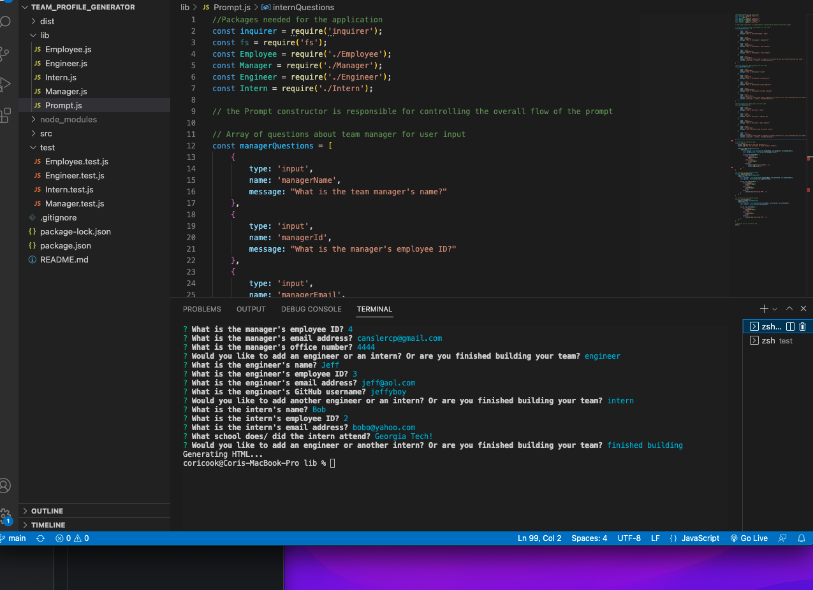
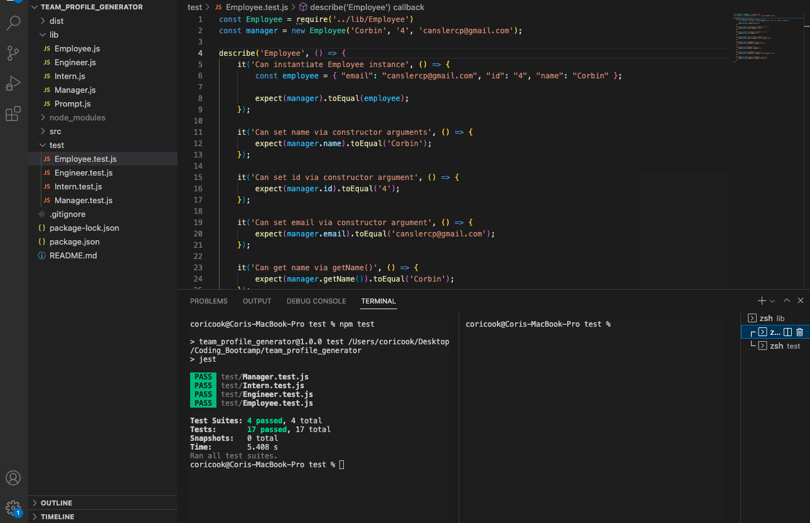

# team_profile_generator
A Node.js command-line application that takes in information about employees on a software engineering team and generates an HTML webpage that displays summaries for each person.

## Description
The Team Profile Generator collects information about the team via a Inquirer prompt. The information is then used to instantiate a class and functions are used to pull specific information to send to an HTML file. One thing to note here is the use of TDD, or Test Driven Development. Testing was set up before the development of the functions, and is used to check the functionality of the functions as well as the classes ability to instantiate and set values via constructor arguments.

This was a homework assignment, built from scratch, for the Georgia Tech Bootcamp. Because of the pacing of the class, I was not able to complete the application. I will still need to write a .js file that sends the prompt information to the html file so that a webpage can be generated to display the team information.

## Installation
Type npm i into your integrated terminal to install

## Use
Type node Prompt.js to run the prompt (given that you have Node installed on your local device)

## Images and Link to Video

[Link to a video demonstration](https://drive.google.com/file/d/1i_3q4vV5byOu4IMTV8b6OiWwWRYLuzzZ/view?usp=sharing)
